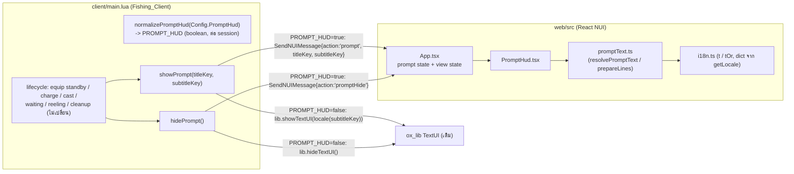

# Design Document

## Overview

ฟีเจอร์นี้เปลี่ยน prompt ตอนตกปลา 2 จุดใน `client/main.lua` — ช่วง **Equip_Standby_Phase** (`equip_hint`) และ **Cancel_Phase** (`cancel_hint`) — จากการเรียก `lib.showTextUI` (ox_lib TextUI มุมขวา) ให้แสดงเป็น **Prompt_HUD** กลางจอด้านล่าง (bottom-center) แบบ title + subtitle โดยใช้ NUI stack เดิมของ resource (React 18 + TypeScript + Vite, สื่อสารผ่าน `SendNUIMessage`/`useNuiEvent`)

หลักการออกแบบสำคัญ:

1. **Presentation-only** — แตะเฉพาะ `client/main.lua` (จุดแสดง/ซ่อน prompt), `config/main.lua` (เพิ่ม toggle), `locales/*.json` (เพิ่ม key), และ `web/src/` (เพิ่ม component + helper) โดยไม่แตะ server logic, ไม่เปลี่ยน server callback/event, ไม่เปลี่ยน lifecycle การตกปลา (Requirement 5)
2. **Config toggle ปลอดภัย** — `Config.PromptHud` เปิด/ปิด Prompt_HUD; ปิดแล้ว fallback กลับไป `lib.showTextUI` เดิมทุกประการ; ค่า nil/ผิดชนิด → default `true` (Requirement 3)
3. **Localization ใช้กลไกเดิม** — Prompt_HUD resolve ข้อความจาก dict ที่โหลดผ่าน NUI callback `getLocale` (en base + active overlay) เหมือน component อื่น ๆ; Lua ส่ง **locale key** ไป NUI ไม่ใช่ข้อความสำเร็จรูป (Requirement 4)
4. **Prompt_HUD เป็น overlay อิสระ** — render แยกจาก `view` state machine เดิม เพื่อให้แสดงได้ทั้งช่วง Equip_Standby (ยังไม่มี view อื่น) และช่วง Cancel_Phase (แสดงพร้อม `waiting` view) โดยไม่ทับซ้อนกับ FishingInfoCard/WaitingHud (Requirement 1, 2)

## Architecture



### จุดตัดสินใจเชิงสถาปัตยกรรม

- **ส่ง locale key ไม่ใช่ข้อความ**: ให้สอดคล้องกับ component ที่มีอยู่ (`FishingInfoCard`/`WaitingHud` ใช้ `t('ui_...')`) และตอบ R4.1 ที่ระบุว่า Prompt_HUD ต้องดึงข้อความจาก Locale_Dictionary ที่โหลดผ่าน `getLocale` เอง การ resolve/fallback จึงอยู่ฝั่ง NUI ทั้งหมด
- **Prompt เป็น state แยก**: ไม่รวมเข้ากับ `view` union เพราะ prompt ต้อง coexist กับ view `waiting` (Cancel_Phase) และต้องแสดงตอน view ยังเป็น `hidden` (Equip_Standby) การรวมเข้า union เดียวจะทำให้แสดงพร้อมกันไม่ได้
- **`getLocale` ไม่แก้ไข**: กลไก en-base + active-overlay ที่มีอยู่ตอบ R4.3 (active ขาด key → ใช้ en) และ R4.6 (ไม่พบไฟล์ภาษา → คง en) อยู่แล้ว ฟีเจอร์นี้เพียงพึ่งพา ไม่เปลี่ยนแปลง

## Components and Interfaces

### 1. Lua: `client/main.lua`

เพิ่มฟังก์ชัน pure + helper 2 ตัว และแทนที่จุดเรียก TextUI 2 จุด

```lua
-- pure: อ่าน Config.PromptHud -> boolean (R3.1, R3.6)
-- boolean คงค่าเดิม; nil หรือชนิดอื่น -> true
local function normalizePromptHud(raw)
    if type(raw) == 'boolean' then return raw end
    return true
end
local PROMPT_HUD = normalizePromptHud(Config.PromptHud)  -- เก็บครั้งเดียวตอน resource start

-- แสดง prompt ตาม toggle (R2.1, R2.3, R3.2, R3.3, R3.4)
local function showPrompt(titleKey, subtitleKey)
    if PROMPT_HUD then
        SendNUIMessage({ action = 'prompt', titleKey = titleKey, subtitleKey = subtitleKey })
    else
        lib.showTextUI(locale(subtitleKey))   -- พฤติกรรมเดิมเป๊ะ
    end
end

-- ซ่อน prompt ตาม toggle (R2.2, R2.6, R3.5)
local function hidePrompt()
    if PROMPT_HUD then
        SendNUIMessage({ action = 'promptHide' })
    else
        lib.hideTextUI()
    end
end
```

**จุดแทนที่ใน `startFishing()`**:

| เดิม | ใหม่ |
|------|------|
| `lib.showTextUI(locale('equip_hint'))` | `showPrompt('equip_title', 'equip_hint')` |
| `lib.hideTextUI()` (หลังกด E ออกจาก standby) | `hidePrompt()` |
| `lib.showTextUI(locale('cancel_hint'))` | `showPrompt('cancel_title', 'cancel_hint')` |

**จุดแทนที่ใน `cleanup()`**: เดิมมี `lib.hideTextUI()` + `SendNUIMessage({ action = 'hide' })` — คง `lib.hideTextUI()` ไว้ (เผื่อ Sell_Prompt / กรณี toggle=false) และให้ action `hide` เคลียร์ทั้ง view และ prompt ฝั่ง NUI (ดู App.tsx) จึงครอบคลุม R2.4 โดยไม่ต้องเพิ่ม message ใหม่

> **ไม่แตะ**: `lib.showTextUI(locale('sell'))` ของ Sell NPC (R5.2), `zfishing:cast/cancel/sellAll/reportWeather` (R5.3–R5.5), ลำดับ lifecycle 6 สถานะ (R5.1), การไม่ส่ง bait arg (R5.4)

### 2. Config: `config/main.lua`

เพิ่ม 1 บรรทัดพร้อมคอมเมนต์ ใกล้ `Config.Locale`:

```lua
-- true  = prompt ตอนตกปลา (equip/cancel) แสดงเป็น HUD กลางจอล่าง (NUI)
-- false = ใช้ ox_lib TextUI มุมขวาแบบเดิม
Config.PromptHud = true
```

### 3. NUI: `web/src/components/PromptHud.tsx` (ใหม่)

Component แสดง title + subtitle กลางจอล่าง

```tsx
import { resolvePromptText, prepareLines } from '../promptText'

type Props = { titleKey: string; subtitleKey: string }

export default function PromptHud({ titleKey, subtitleKey }: Props) {
  const title = resolvePromptText(titleKey)      // R2.7, R4.4
  const subtitle = resolvePromptText(subtitleKey)
  const [titleLine, subtitleLine] = prepareLines(title, subtitle)  // R1.7, R1.8

  if (!titleLine && !subtitleLine) return null   // ไม่มีอะไรให้แสดง

  return (
    <div className="prompt-hud">
      {titleLine && <div className="prompt-title">{titleLine}</div>}
      {subtitleLine && <div className="prompt-subtitle">{subtitleLine}</div>}
    </div>
  )
}
```

### 4. NUI: `web/src/promptText.ts` (ใหม่ — pure logic ที่ทำ property test)

```ts
import { tOr } from './i18n'

export const MAX_LINE = 120

// fallback ต่อ key (R4.4): เมื่อ dict ไม่มี key ทั้ง active และ en
const FALLBACK: Record<string, string> = {
  equip_title:  'Fishing',
  equip_hint:   '[E] Start fishing   ·   [X] Pack up rod',
  cancel_title: 'Reeling',
  cancel_hint:  '[X] Pack up rod',
}

// R2.7, R4.4: คืนค่าจาก dict ถ้ามีและไม่ว่าง มิฉะนั้นคืน fallback; ไม่คืน raw key
export function resolvePromptText(key: string): string {
  const fallback = FALLBACK[key] ?? ''
  const v = tOr(key, fallback)
  return v.trim().length > 0 ? v : fallback
}

// R1.7 + R1.8: ตัดบรรทัดว่าง/ช่องว่างล้วน/null ออก และ truncate <= MAX_LINE
export function prepareLines(
  title?: string | null,
  subtitle?: string | null,
): [string | null, string | null] {
  return [prepareLine(title), prepareLine(subtitle)]
}

function prepareLine(text?: string | null): string | null {
  if (text == null) return null
  const trimmed = text.trim()
  if (trimmed.length === 0) return null
  return trimmed.length > MAX_LINE ? trimmed.slice(0, MAX_LINE) : trimmed
}
```

> `resolvePromptText` แยก title/subtitle เพื่อรองรับ R1.7 (บรรทัดใดว่างก็ไม่แสดงบรรทัดนั้น) — `prepareLines` เป็นด่านสุดท้ายก่อน render จึงกรอง empty ได้แม้ resolve คืนค่าว่างในกรณีสุดโต่ง

### 5. NUI: `web/src/App.tsx` (แก้ไข)

เพิ่ม `prompt` state และ render `PromptHud` แยกจาก view state machine

```tsx
type Prompt = { titleKey: string; subtitleKey: string } | null
const [prompt, setPrompt] = useState<Prompt>(null)

useNuiEvent((msg) => {
  switch (msg.action) {
    // ... case เดิมทั้งหมดคงไว้ ...
    case 'prompt':     setPrompt({ titleKey: msg.titleKey, subtitleKey: msg.subtitleKey }); break
    case 'promptHide': setPrompt(null); break
    case 'hide':       setView('hidden'); setData({}); setPrompt(null); break  // เคลียร์ prompt ด้วย (R2.4)
  }
})

// โครงสร้าง render ใหม่: ไม่ return null ทันทีเมื่อ view === 'hidden'
if (!ready) return null
if (admin) return <AdminPanel config={admin} onClose={() => setAdmin(null)} />

return (
  <>
    {view !== 'hidden' && (
      <div className="hud-root">{/* casting/waiting/reeling/caught เดิม */}</div>
    )}
    {prompt && <PromptHud titleKey={prompt.titleKey} subtitleKey={prompt.subtitleKey} />}
  </>
)
```

### 6. NUI: `web/src/style.css` (เพิ่ม)

```css
/* Prompt_HUD: กลางจอแนวนอน, ชิดล่าง 5–10% (R1.1), ไม่รับ pointer (R1.5) */
.prompt-hud {
  position: fixed;
  left: 50%;
  bottom: 7vh;                 /* อยู่ในช่วง 5–10% ของความสูงจอ */
  transform: translateX(-50%);
  max-width: 40vw;             /* จำกัดความกว้าง -> ไม่ชนกับ hud-root ฝั่งขวา (R2.5) */
  text-align: center;
  pointer-events: none;        /* R1.5 */
  display: flex;
  flex-direction: column;      /* subtitle อยู่ใต้ title (R1.3) */
  align-items: center;
  gap: 0.6vh;
}
.prompt-title    { font-size: 3vh;   font-weight: 700; color: var(--text); }  /* R1.2: >= 1.5x subtitle */
.prompt-subtitle { font-size: 1.8vh; color: var(--muted); }
```

> **R2.5 (overlap = 0px)**: `hud-root` ยึด `right: 2vw` + `min-width: 16vw` (กินพื้นที่ประมาณ 82vw–98vw ในแนวนอน) ส่วน `.prompt-hud` อยู่กึ่งกลาง `max-width: 40vw` (กินพื้นที่ 30vw–70vw) ขอบขวาสุดของ prompt (70vw) < ขอบซ้ายสุดของ hud-root (82vw) → ไม่มีการซ้อนทับในแนวนอนไม่ว่าความสูงจะทับกันหรือไม่

### 7. Locales: `locales/en.json` + `locales/th.json` (เพิ่ม key)

| key | en | th |
|-----|----|----|
| `equip_title` | `Fishing` | `การตกปลา` |
| `cancel_title` | `Reeling` | `กำลังตกปลา` |

(`equip_hint`, `cancel_hint` มีอยู่แล้ว ใช้เป็น Subtitle_Text)

## Data Models

### NUI Message (Lua → NUI ผ่าน `SendNUIMessage`)

```ts
// prompt แสดง
{ action: 'prompt', titleKey: string, subtitleKey: string }
// prompt ซ่อน (เฉพาะ prompt)
{ action: 'promptHide' }
// เดิม: hide ทั้งหมด (view + prompt)
{ action: 'hide' }
```

### App state (NUI)

```ts
type View = 'hidden' | 'casting' | 'waiting' | 'reeling' | 'caught'   // เดิม ไม่เปลี่ยน
type Prompt = { titleKey: string; subtitleKey: string } | null        // เพิ่มใหม่
```

### Config

```lua
Config.PromptHud : boolean   -- อ่านครั้งเดียว -> normalizePromptHud -> PROMPT_HUD (boolean ต่อ session)
```

### Locale_Dictionary (คงรูปแบบเดิม)

flat `Record<string,string>` โหลดผ่าน `getLocale` (en base overlay ด้วยภาษา active) — เพิ่มเพียง key `equip_title`, `cancel_title`

## Correctness Properties

*A property is a characteristic or behavior that should hold true across all valid executions of a system — essentially, a formal statement about what the system should do. Properties serve as the bridge between human-readable specifications and machine-verifiable correctness guarantees.*

ฟีเจอร์นี้เป็น presentation-only เป็นหลัก แต่มี pure logic ฝั่ง NUI (TypeScript) ที่แปรผันตาม input และมี invariant ชัดเจน จึงเหมาะกับ property-based testing เฉพาะ 2 จุด (ตัดบรรทัด/กรองบรรทัดว่าง และ locale fallback) ส่วน acceptance criteria อื่น ๆ เป็น CSS layout, gating ฝั่ง Lua, และ regression เชิงโครงสร้าง ซึ่งครอบคลุมด้วย example/smoke/visual test (ดู Testing Strategy)

### Property 1: การเตรียมบรรทัด prompt กรองบรรทัดว่างและตัดความยาว

*For any* คู่ค่า title และ subtitle (เป็น string ใด ๆ รวมถึงสตริงว่าง, สตริงช่องว่างล้วน, `null`, หรือข้อความยาวเกิน 120 ตัวอักษร) ผลลัพธ์จาก `prepareLines` จะต้องไม่มีบรรทัดที่เป็นค่าว่าง/ช่องว่างล้วน/null (บรรทัดเหล่านั้นถูกแทนด้วย `null`) และทุกบรรทัดที่ไม่ใช่ `null` จะต้องมีความยาวไม่เกิน 120 ตัวอักษร โดยยังคงบรรทัดที่มีข้อความไว้เสมอ

**Validates: Requirements 1.7, 1.8**

### Property 2: การ resolve ข้อความ prompt มี fallback เสมอ

*For any* locale dictionary ใด ๆ (มีหรือไม่มี key, ค่าเป็นข้อความจริง/ว่าง/ช่องว่างล้วน) และ key ของ prompt (`equip_title`/`equip_hint`/`cancel_title`/`cancel_hint`) ผลลัพธ์จาก `resolvePromptText` จะต้องคืนค่าจาก dictionary เมื่อค่านั้นเป็นข้อความที่ไม่ว่าง มิฉะนั้นคืนค่า fallback ที่กำหนดไว้ล่วงหน้า และจะต้องไม่คืน raw key และไม่คืนสตริงว่าง

**Validates: Requirements 2.7, 4.4**

## Error Handling

| กรณี | การจัดการ | Requirement |
|------|-----------|-------------|
| `Config.PromptHud` เป็น nil หรือไม่ใช่ boolean | `normalizePromptHud` คืน `true` (default เปิด HUD) | R3.6 |
| `getLocale` fetch ล้มเหลว (นอก FiveM / callback error) | `loadLocale` ตั้ง `dict = {}` → `resolvePromptText` คืน fallback ต่อ key | R4.4 |
| locale key หายทั้ง active และ en | `tOr(key, fallback)` → คืน fallback (ไม่คืน raw key) | R2.7, R4.4 |
| title หรือ subtitle ที่ resolve ได้เป็นค่าว่าง/ช่องว่าง | `prepareLines` แทนด้วย `null` → ไม่ render บรรทัดนั้น; ถ้าว่างทั้งคู่ component คืน `null` | R1.7 |
| ข้อความยาวเกิน 120 ตัวอักษร | `prepareLine` ตัดเหลือ 120 ตัวอักษร | R1.8 |
| `Config.Locale` ไม่ตรงไฟล์ภาษา | `getLocale` เดิม: `load(lang)` คืน nil → ไม่ overlay → dict คง en | R4.6 |
| server callback/event ล้มเหลว (`res` ไม่ ok / ไม่มี response) | คงพฤติกรรมเดิม: `cleanup(('error_'..reason), 'error')` + `lib.notify` (ไม่แตะ) | R5.6 |

## Testing Strategy

### Property-Based Tests (fast-check + Vitest, ฝั่ง NUI/TypeScript)

ฟีเจอร์นี้เพิ่ม pure logic ฝั่ง NUI จึงเพิ่มชุด PBT ใน `web/` โดยใช้ **fast-check** (property lib) + **Vitest** (runner) — ไม่เขียน property framework เอง

- ที่ตั้งเทสต์: `web/src/__tests__/promptText.test.ts`
- config: รันขั้นต่ำ **100 iterations** ต่อ property (`fc.assert(fc.property(...), { numRuns: 100 })`)
- แต่ละเทสต์ tag อ้างอิง property ในรูปแบบ: `// Feature: fishing-prompt-hud, Property {n}: {property text}`
- แต่ละ correctness property ทำเป็น property test **เดียว**:
  - Property 1 → generate `fc.oneof(fc.string(), constant(''), whitespace strings, constant(null), long strings > 120)` เป็น title/subtitle แล้ว assert: ไม่มีบรรทัดว่าง/null-source ที่ยังคงอยู่ และทุกบรรทัด length ≤ 120
  - Property 2 → generate dict สุ่ม (`fc.dictionary`) + key จาก prompt keys แล้ว assert: คืน dict value เมื่อไม่ว่าง มิฉะนั้นคืน fallback, ไม่เท่ากับ raw key, ไม่ว่าง

คำสั่งรัน (จาก `web/`):
```bash
npx vitest --run
```

### Example / Unit Tests (ฝั่ง NUI)

- Prompt component แสดง title ก่อน subtitle (DOM order, R1.3); ว่างทั้งคู่ → คืน null (R1.4)
- App: `view='hidden'` แต่ `prompt != null` → render `PromptHud` (Equip_Standby ก่อนมี view); action `hide` → `prompt=null` (R2.4); action `promptHide` → `prompt=null` (R2.2/R2.6)
- App: render null จน `ready=true` หลัง `loadLocale` (R4.1)

### CSS / Visual Checks

- `.prompt-hud`: `pointer-events:none` (R1.5), `bottom` อยู่ในช่วง 5–10% (R1.1), `flex-direction:column` + subtitle ใต้ title (R1.3), font ratio `3vh/1.8vh ≈ 1.66x ≥ 1.5` (R1.2)
- overlap 0px (R2.5): ยืนยันเชิงเรขาคณิตจาก CSS (prompt center max-width 40vw ↔ hud-root right min-width 16vw ไม่ซ้อนแนวนอน) + visual check ในเกม

### Smoke / Data Checks

- `locales/en.json` และ `locales/th.json` มี key `equip_title`, `cancel_title` ครบ (R4.2)

### Lua Example / Regression Checks

Lua ใน resource นี้ยังไม่มี test runner ตั้งไว้ ส่วนที่เป็น Lua จึงใช้ example-based verification (busted ถ้าจะเพิ่ม harness หรือทดสอบในเกม) เนื่องจากตรรกะแตกกิ่งน้อยและ enumerate ได้:

- `normalizePromptHud`: `true→true`, `false→false`, `nil→true`, `''→true`, `0→true`, `{}→true` (R3.1, R3.6)
- `showPrompt`/`hidePrompt` เลือก branch ถูกตาม `PROMPT_HUD`: true → `SendNUIMessage(action 'prompt'/'promptHide')`; false → `lib.showTextUI(locale(subtitleKey))`/`lib.hideTextUI()` (R1.6, R3.2–R3.5)
- phase mapping: standby → `showPrompt('equip_title','equip_hint')`; หลัง cast สำเร็จ → `showPrompt('cancel_title','cancel_hint')` (R2.1, R2.3)
- Regression (R5): ตรวจด้วย code review ว่า lifecycle 6 สถานะครบลำดับเดิม (R5.1), Sell_Prompt เดิม (R5.2), signature/payload ของ `zfishing:cast/cancel/sellAll/reportWeather` ไม่เปลี่ยน (R5.3), cast ยังส่งแค่ `(power, rodSlot)` ไม่มี bait (R5.4), weather thread ยัง `Wait(60000)` (R5.5), path error → `cleanup` เดิม (R5.6)
