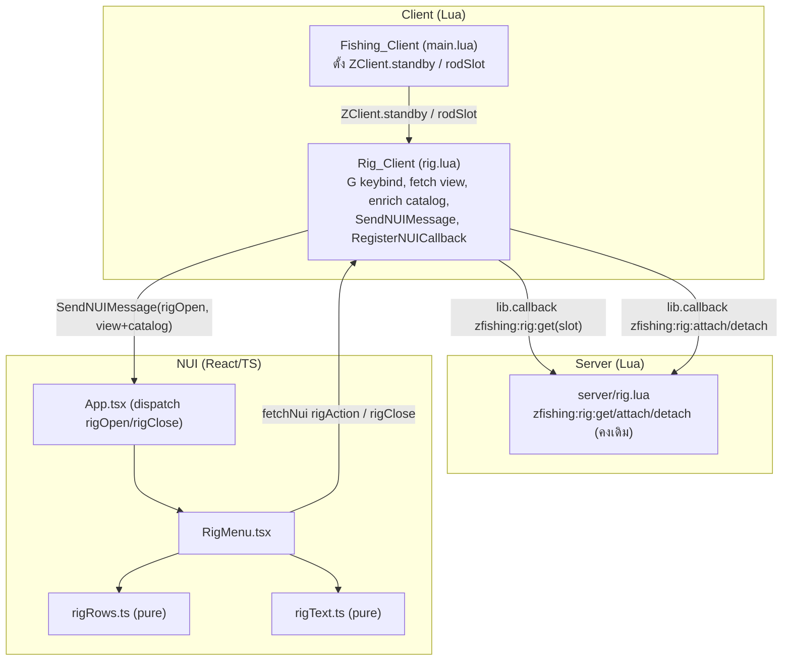
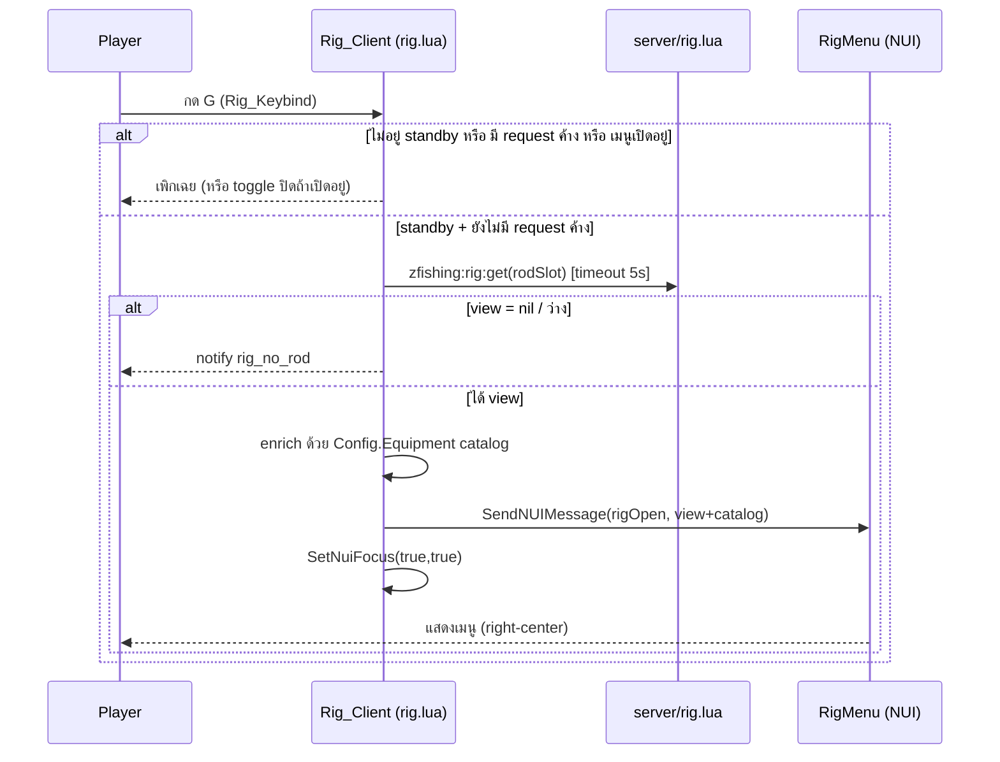
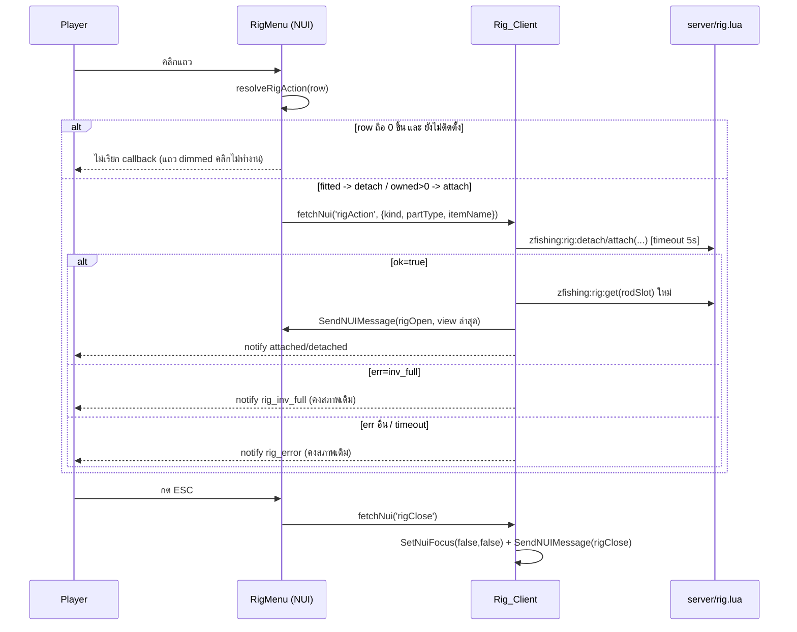

# Design Document

## Overview

ฟีเจอร์นี้แทนที่เมนูจัดการเบ็ด (rod assembly / "rig") ที่ปัจจุบันเป็น ox_lib context menu ด้วย **NUI menu ใหม่** (React 18 + TypeScript + Vite) ที่เปิดด้วยปุ่ม **G** ในช่วง Equip_Standby_Phase และแสดงรายการชิ้นส่วนเบ็ด (reel/line/hook/float) แบบ list — แต่ละแถวมี icon + ชื่อ item + จำนวนที่ถือ (`Nx`) โดยแถวที่ถือ 0 ชิ้นจะจางลง (dimmed) เมนูวางชิดกึ่งกลางแนวตั้งฝั่งขวาของจอ และปิดด้วย ESC

หลักการออกแบบสำคัญ 3 ข้อ:

1. **ไม่แตะ server logic ของ rig** — callback `zfishing:rig:get`/`attach`/`detach` คง signature และโครงสร้าง return เดิมทุกรายการ (Requirement 7). การเปลี่ยนแปลงทั้งหมดจำกัดอยู่ที่ฝั่งการนำเสนอ (Rig_Client + NUI) และช่องทางเปิดเมนู
2. **เสริมข้อมูลฝั่ง client** — `zfishing:rig:get` เดิมคืนเฉพาะชิ้นส่วนที่ติดตั้งอยู่ (`parts`) และชิ้นสำรองที่ถือ (`carried`, จำนวน > 0 เท่านั้น) แต่เมนูใหม่ต้องแสดงแถวที่ถือ 0 ชิ้นแบบ dimmed ด้วย ดังนั้น Rig_Client จะ**อ่านแคตตาล็อกชิ้นส่วนทั้งหมดจาก `Config.Equipment`** (ซึ่งเป็น shared_script อยู่บน client อยู่แล้ว) แล้วประกอบกับ Rig_View เพื่อคำนวณ Owned_Quantity ของทุกชิ้น — วิธีนี้ทำให้ไม่ต้องแก้ signature ของ `zfishing:rig:get`
3. **ปุ่ม G เป็นช่องทางเดียว** — ลบ ox_lib context menu, event `zfishing:manageRod` handler และคำสั่ง `/fishrig` ออกทั้งหมด (Requirement 5)

### สถาปัตยกรรมการสื่อสาร NUI (มีอยู่แล้วในโปรเจ็กต์)

โปรเจ็กต์มี pattern การสื่อสาร NUI ที่ใช้ซ้ำได้ทันที:

- **Lua → NUI:** `SendNUIMessage({ action = ... })` ถูกจับที่ `useNuiEvent()` (`web/src/hooks/useNui.ts`) แล้ว dispatch ตาม `msg.action` ใน `App.tsx`
- **NUI → Lua:** `fetchNui('event', data)` → `RegisterNUICallback('event', cb)` (ฝั่ง Lua)
- **Locale:** NUI callback `getLocale` มีอยู่แล้วใน `client/main.lua` — โหลด `locales/en.json` เป็นฐานแล้ว overlay ด้วยภาษา active; ฝั่ง NUI ใช้ `loadLocale()` + `t()`/`tOr()` (`web/src/i18n.ts`)
- **Focus:** `SetNuiFocus(bool, bool)` ควบคุมการรับ input

ฟีเจอร์นี้จึง**ต่อยอด** pattern เดิมโดยไม่สร้างกลไกใหม่

### ขอบเขตการเปลี่ยนแปลงไฟล์

| ไฟล์ | การเปลี่ยนแปลง |
|------|----------------|
| `client/rig.lua` | เขียนใหม่: ลบ ox_lib context / `manageRod` / `rig:open`, เพิ่ม G keybind, fetch view, เสริม catalog, ส่ง NUI, callback รับ action/close |
| `client/main.lua` | เพิ่ม shared flag `ZClient.standby` ระหว่างช่วง equip-standby loop (surgical) |
| `server/rig.lua` | ลบ `RegisterCommand('fishrig')` |
| `web/src/App.tsx` | เพิ่ม overlay `RigMenu` (dispatch `rigOpen`/`rigClose`) |
| `web/src/components/RigMenu.tsx` | ใหม่: เรนเดอร์เมนู |
| `web/src/rigRows.ts` | ใหม่: pure logic ประกอบแถว/จัดรูปแบบจำนวน/ตัดสิน action (unit + property test) |
| `web/src/rigText.ts` | ใหม่: resolve ข้อความ locale ของเมนู + fallback |
| `locales/en.json`, `locales/th.json` | เพิ่ม key: `rig_close_hint`, `rig_empty`, `rig_locale_error` |
| `fxmanifest.lua` | เพิ่ม `'assets/items/*.png'` ใน `files{}` ให้ NUI โหลด icon ได้ |

## Architecture



### ลำดับการทำงาน: เปิดเมนูด้วยปุ่ม G



### ลำดับการทำงาน: attach/detach และปิดเมนู



### การตรวจจับ Equip_Standby_Phase

ช่วง standby คือ loop ใน `startFishing()` (`main.lua`) ที่รอปุ่ม E:

```lua
while ZClient.active and not IsControlJustPressed(0, 38) do Wait(0) end
```

Rig_Client ต้องรู้ว่ากำลังอยู่ในช่วงนี้ จึงเพิ่ม flag ร่วม `ZClient.standby = true` ก่อนเข้า loop และ `= false` เมื่อออก (surgical change) Rig_Client อ่าน `ZClient.standby` และ `ZClient.rodSlot` (มีอยู่แล้ว) เพื่อ gate การเปิดเมนูและระบุ slot ของเบ็ด เมื่อ fishing cleanup ทำงาน ให้ปิดเมนูด้วย (Requirement 3.4)

## Components and Interfaces

### Rig_Client (`client/rig.lua`) — เขียนใหม่

รับผิดชอบสถานะเมนูฝั่ง client ทั้งหมด เก็บ state ภายใน:

```lua
local RigState = {
    open = false,        -- Rig_Menu กำลังแสดงอยู่หรือไม่
    pending = false,     -- มี request rig:get ค้างอยู่ (กันกดซ้ำ, Req 1.8)
}
```

**อินเทอร์เฟซหลัก:**

- `RegisterCommand('zfishing_rig', handler, false)` + `RegisterKeyMapping('zfishing_rig', 'Manage fishing rod', 'keyboard', 'G')` — ลงทะเบียน Rig_Keybind (Req 1.1, 1.5)
- `handler`: toggle logic — ถ้าเปิดอยู่ → ปิด; ถ้ายังไม่เปิด → gate (standby? ไม่ pending? ยังไม่เปิด?) แล้วเปิด (Req 1.2–1.4, 1.8)
- `RegisterNUICallback('rigClose', cb)` — ปิดเมนูจาก ESC (Req 3.2, 3.3)
- `RegisterNUICallback('rigAction', cb)` — รับ `{ kind='attach'|'detach', partType, itemName }` แล้วเรียก server callback (Req 4)
- `closeMenu()` — จุดปิดเมนูจุดเดียว (idempotent): `SetNuiFocus(false,false)` + `SendNUIMessage({action='rigClose'})` เสมอ (Req 3.4, 3.6, 3.7)

**การเสริม catalog (enrichment):** เมื่อได้ `view` จาก `zfishing:rig:get` Rig_Client ประกอบ payload ส่งให้ NUI:

```lua
-- catalog: enumerate ทุกชิ้นส่วนจาก Config.Equipment (client อ่าน shared config ได้)
-- ส่ง view (โครงเดิม) + catalog ให้ NUI ไปประกอบแถวเอง
SendNUIMessage({ action = 'rigOpen', view = view, catalog = buildCatalog() })
```

โดย `buildCatalog()` คืน list `{ partType, name, label }` ของทุก item ใน `Config.Equipment.reels/lines/hooks/floats`

### server/rig.lua — เปลี่ยนแปลงเล็กน้อย

- **ลบ** `RegisterCommand('fishrig', ...)` ทั้งบล็อก (Req 5.3)
- **คงเดิมทุกอย่าง:** `zfishing:rig:get/attach/detach`, `Rig.*`, และ event `zfishing:rig:notify` (Req 7.1, 7.2)

### App.tsx — เพิ่ม overlay

เพิ่ม state `rig` (แยกจาก `view` state machine ของ HUD หลัก) และ dispatch:

```tsx
type RigData = { view: RigView; catalog: CatalogEntry[] } | null
const [rig, setRig] = useState<RigData>(null)
// ใน useNuiEvent switch:
case 'rigOpen':  setRig({ view: msg.view, catalog: msg.catalog }); break
case 'rigClose': setRig(null); break
// ใน render (overlay อิสระ เหมือน PromptHud):
{rig && <RigMenu view={rig.view} catalog={rig.catalog} />}
```

### RigMenu.tsx — component ใหม่

- เรนเดอร์ container ชิด right-center (`position: fixed; right: ≥2vw; top: 50%; transform: translateY(-50%)`) (Req 2.9)
- หัวข้อจาก `rigText('rig_title')` + บรรทัด `rigText('rig_close_hint')` (Req 2.1)
- เรียก `buildRigRows(view, catalog)` แล้ว map เป็น `<RigRow>` ตามลำดับ (Req 2.2)
- ถ้าไม่มีแถว → แสดงหัวข้อ + hint + `rigText('rig_empty')` (Req 2.8)
- แต่ละแถว: `` (Req 2.4) + label + `formatOwned(owned)` (Req 2.3); `onError` ของ img → ซ่อนรูปแต่คง box ขนาดคงที่ (Req 2.7); opacity ตาม `isDimmed(owned)` (Req 2.5, 2.6)
- `onClick` แถว → `resolveRigAction(row)`; ถ้าได้ action → `fetchNui('rigAction', ...)`, ถ้า blocked → ไม่เรียก (Req 4.1–4.3)
- keydown ESC → `fetchNui('rigClose')` (Req 3.2)
- ก่อนเรนเดอร์ครั้งแรกต้องรอ `loadLocale()` (มีใน App แล้ว, Req 6.1); ถ้าโหลด locale ไม่สำเร็จให้ใช้ค่าฐาน + แสดง `rig_locale_error` (Req 6.5)

### Pure logic modules (`web/src/rigRows.ts`, `web/src/rigText.ts`)

แยก logic ที่ทดสอบได้ออกจาก React component:

```ts
// rigRows.ts
export type PartType = 'reel' | 'line' | 'hook' | 'float'
export interface CatalogEntry { partType: PartType; name: string; label: string }
export interface RigView {
  rod: string; rodLabel: string
  parts: Partial<Record<PartType, { name: string; label: string; dur: number; max: number }>>
  carried: Record<PartType, { slot: number; name: string; label: string; dur: number; max: number }[]>
}
export interface RigRow {
  partType: PartType; name: string; label: string
  owned: number; fitted: boolean
}
export type RigAction =
  | { kind: 'attach'; partType: PartType; itemName: string }
  | { kind: 'detach'; partType: PartType }
  | { kind: 'blocked' }

export const PART_ORDER: PartType[] = ['reel', 'line', 'hook', 'float']

export function buildRigRows(view: RigView, catalog: CatalogEntry[]): RigRow[]
export function formatOwned(n: number): string        // clamp 0..9999 -> `${n}x`
export function isDimmed(owned: number): boolean       // owned === 0
export function resolveRigAction(row: RigRow): RigAction
```

```ts
// rigText.ts — เหมือน promptText.ts: มีตาราง fallback ต่อ key
export function rigText(key: string): string
```

## Data Models

### Rig_View (จาก `zfishing:rig:get` — โครงสร้างเดิม, ห้ามเปลี่ยน)

```
view = {
  rod      = string,          -- ชื่อ item ของเบ็ด
  rodLabel = string,
  rodDur   = number, rodMax = number,
  missing  = string[],        -- part types ที่ยังว่าง
  parts    = {                -- ชิ้นส่วนที่ติดตั้งอยู่ (มีเฉพาะที่ติดตั้ง)
    [partType] = { name, label, dur, max }
  },
  carried  = {                -- ชิ้นสำรองในกระเป๋า ต่อ partType (จำนวน > 0 เท่านั้น)
    [partType] = { { slot, name, label, dur, max }, ... }
  }
}
```

### Catalog Entry (สร้างฝั่ง client จาก `Config.Equipment`)

```
{ partType: 'reel'|'line'|'hook'|'float', name: string, label: string }
```

รวมทุก item ที่นิยามใน `Config.Equipment.reels/lines/hooks/floats` (เช่น `reel_cheap`, `line_10`, `hook_2`, `float_wood`)

### Rig_Row (คำนวณโดย `buildRigRows`)

```
{ partType, name, label, owned: number, fitted: boolean }
```

**กติกาการประกอบ (นิยามให้ deterministic เพื่อทดสอบได้):**

- **ลำดับ:** ไล่ตาม `PART_ORDER = [reel, line, hook, float]` ภายในแต่ละ partType เรียงตามชื่อ item จากน้อยไปมาก (ascending) — ให้ผลคงที่เสมอสำหรับ input เดียวกัน (Req 2.2)
- **owned:** = จำนวน entry ใน `view.carried[partType]` ที่ `name === row.name` (นับชิ้นสำรองในกระเป๋า; ชิ้นที่ติดตั้งบนเบ็ดไม่นับเป็น owned)
- **fitted:** = `view.parts[partType]?.name === row.name`
- แถวหนึ่งต่อหนึ่ง item ใน catalog

### NUI Message payloads

```
-- Lua -> NUI
{ action = 'rigOpen',  view = <Rig_View>, catalog = <CatalogEntry[]> }
{ action = 'rigClose' }

-- NUI -> Lua (fetchNui)
'rigAction' body: { kind = 'attach'|'detach', partType = <PartType>, itemName? = string }
'rigClose'  body: {}
'getLocale' body: {}   -- มีอยู่แล้ว
```

### Locale keys ที่เพิ่ม (`locales/en.json` + `locales/th.json`)

| key | en (ฐาน) | หมายเหตุ |
|-----|----------|----------|
| `rig_close_hint` | `Press ESC to close` | Req 2.1, 6.2 |
| `rig_empty` | `No rod parts to manage` | Req 2.8 |
| `rig_locale_error` | `Language failed to load` | ตัวบ่งชี้ Req 6.5 |

(`rig_title`, `rig_no_rod`, `rig_inv_full`, `rig_error`, `attached`, `detached` มีอยู่แล้ว)

## Correctness Properties

*A property is a characteristic or behavior that should hold true across all valid executions of a system — essentially, a formal statement about what the system should do. Properties serve as the bridge between human-readable specifications and machine-verifiable correctness guarantees.*

การทดสอบแบบ property-based (PBT) ใช้ได้กับ **pure logic** ของฟีเจอร์นี้ ได้แก่ การประกอบแถว (`buildRigRows`), การจัดรูปแบบจำนวน (`formatOwned`), การกำหนด dimming (`isDimmed`), การตัดสิน action (`resolveRigAction`), การ map ผลลัพธ์ callback เป็น locale key และการ resolve ข้อความ locale (`rigText`) ส่วนที่เป็น FiveM native, การจับเวลา, NUI focus และการเรนเดอร์ CSS ทดสอบด้วย example/integration/smoke (ดู Testing Strategy)

ไลบรารีทดสอบ: **fast-check** (มีอยู่แล้วใน `web/package.json`) รันขั้นต่ำ 100 iterations ต่อ property แต่ละเทสต์ติดแท็กอ้างอิง property ในเอกสารนี้

### Property 1: การประกอบแถวถูกต้องและ deterministic

*For any* Rig_View และ catalog ใด ๆ, ผลจาก `buildRigRows(view, catalog)` จะต้อง (ก) มีจำนวนแถวเท่ากับจำนวน entry ใน catalog หนึ่งต่อหนึ่ง item, (ข) เรียงตาม `PART_ORDER = [reel, line, hook, float]` แล้วภายในแต่ละ partType เรียงตามชื่อ item จากน้อยไปมาก (ให้ผลลำดับคงที่เสมอสำหรับ input เดียวกัน), (ค) แต่ละแถวมี `owned` เท่ากับจำนวน entry ใน `view.carried[partType]` ที่ชื่อตรงกัน และ `owned >= 0`, (ง) `fitted` เป็น true ก็ต่อเมื่อ `view.parts[partType].name` ตรงกับชื่อ item ของแถวนั้น

**Validates: Requirements 2.2**

### Property 2: การจัดรูปแบบจำนวนที่ถือ

*For any* จำนวน `n` (จำนวนเต็ม, ทศนิยม, ค่าลบ หรือค่ามากกว่า 9999), ผลจาก `formatOwned(n)` จะต้องอยู่ในรูปแบบ `Nx` โดย `N` เป็นจำนวนเต็มที่ถูก clamp ไว้ในช่วง 0 ถึง 9999 เสมอ (ค่าน้อยกว่า 0 กลายเป็น 0, ค่ามากกว่า 9999 กลายเป็น 9999)

**Validates: Requirements 2.3**

### Property 3: การจางของแถวสัมพันธ์กับจำนวนที่ถือ

*For any* ค่า `owned` ใด ๆ, แถวจะถูกทำให้จาง (`isDimmed(owned)` เป็น true) ก็ต่อเมื่อ `owned === 0` และค่า opacity ที่ใช้เรนเดอร์ทั้ง Item_Icon และตัวอักษรจะต้องไม่เกิน 0.5 เมื่อแถวจาง และเท่ากับ 1.0 เมื่อแถวไม่จาง

**Validates: Requirements 2.5, 2.6**

### Property 4: การตัดสิน action จากแถว

*For any* Rig_Row ใด ๆ, ผลจาก `resolveRigAction(row)` จะต้องเป็น: `detach(partType)` เมื่อแถวนั้นติดตั้งอยู่ (`fitted` เป็น true); `attach(partType, name)` เมื่อแถวยังไม่ติดตั้งและ `owned > 0`; และ `blocked` (ไม่เรียก callback ใด ๆ) เมื่อแถวยังไม่ติดตั้งและ `owned === 0`

**Validates: Requirements 4.1, 4.2, 4.3**

### Property 5: การ map ผลลัพธ์ callback เป็น locale key

*For any* ผลลัพธ์การเรียก server callback (`{ ok = true }` หรือ `{ ok = false, err = ... }` หรือ timeout) และชนิดของ action (attach/detach), ค่า locale key ที่เลือกแจ้งเตือนจะต้องเป็น: `attached` เมื่อ ok และเป็น attach; `detached` เมื่อ ok และเป็น detach; `rig_inv_full` เมื่อ `err === 'inv_full'`; และ `rig_error` สำหรับ err อื่นทั้งหมดรวมถึงกรณี timeout

**Validates: Requirements 4.5, 4.6, 4.7, 4.8**

### Property 6: การ resolve ข้อความ locale มี fallback เสมอ

*For any* locale dictionary ใด ๆ (มีหรือไม่มี key, ค่าเป็นข้อความจริง/ว่าง/ช่องว่างล้วน) และ key ของ Rig_Menu, ผลจาก `rigText(key)` จะต้องคืนค่าจาก dictionary เมื่อค่านั้นเป็นข้อความที่ไม่ว่าง (dictionary นี้ถูก overlay ค่าภาษา en เป็นฐานแล้วฝั่ง server ทำให้ key ที่ขาดในภาษา active ได้ค่า en); มิฉะนั้นคืนค่า fallback ที่กำหนดไว้ล่วงหน้าในโค้ด — และจะต้องไม่คืน raw key และไม่คืนสตริงว่างในทุกกรณี

**Validates: Requirements 6.3, 6.4**

## Error Handling

| สถานการณ์ | การจัดการ | Requirement |
|-----------|-----------|-------------|
| `zfishing:rig:get` คืน `nil`/ว่าง | ไม่เปิดเมนู, notify `rig_no_rod` | 1.6 |
| `zfishing:rig:get` ไม่ตอบใน 5000ms | ยกเลิกการเปิด, คงเมนูปิด, notify `rig_error` | 1.7 |
| กด G ขณะมี request ค้าง (`pending`) | เพิกเฉย ไม่ส่ง request ซ้ำ | 1.8 |
| แถว `owned === 0` และไม่ได้ติดตั้ง | ไม่เรียก callback (แถว dimmed, resolveRigAction คืน blocked); ถ้ามีการพยายามจริงให้ notify `rig_error` | 4.3 |
| `attach`/`detach` err `inv_full` | notify `rig_inv_full`, คงสภาพเบ็ดเดิม | 4.7 |
| `attach`/`detach` err อื่น | notify `rig_error`, คงสภาพเบ็ดเดิม | 4.8 |
| `attach`/`detach` ไม่ตอบใน 5s | ยกเลิกการรอ, notify `rig_error`, คงสภาพเดิม | 4.9 |
| callback rig ไม่ตอบใน 10s | คงข้อมูลที่แสดงไว้เดิม + notify ผ่านช่องทางเดิม | 7.5, 7.6 |
| ปิดเมนูผ่าน `fetchNui` ไม่สำเร็จ/ไม่ตอบใน 500ms | client fallback: `SetNuiFocus(false,false)` + ซ่อนเมนู | 3.5 |
| คืน focus สำเร็จแต่ซ่อน UI ล้มเหลว | cleanup บางส่วนต่อ, คง `SetNuiFocus(false,false)` เพื่อไม่ให้เมาส์ค้าง | 3.7 |
| ปิดเมนูซ้ำขณะปิดอยู่แล้ว | idempotent — เพิกเฉย คง focus `false,false` | 3.6 |
| icon โหลดไม่ได้ | `onError` ซ่อนรูป คง box ขนาดคงที่, ยังแสดง label + qty | 2.7 |
| `getLocale` ล้มเหลว/timeout | ใช้ค่าฐาน (en) ทุก key + แสดง `rig_locale_error`, เรนเดอร์ต่อ | 6.5 |

**หลักการปิดเมนู (safety):** `closeMenu()` เป็นจุดเดียวที่ปิดเมนู เรียก `SetNuiFocus(false,false)` **เป็นสิ่งแรกเสมอ** ก่อนพยายามซ่อน UI เพื่อรับประกันว่าเมาส์ไม่ค้างบนหน้าจอไม่ว่าขั้นตอนหลังจะล้มเหลวหรือไม่ (Req 3.4, 3.7) และเป็น idempotent ผ่าน flag `RigState.open` (Req 3.6)

## Testing Strategy

### Property-based tests (fast-check, ≥100 iterations)

ทดสอบ pure logic ใน `web/src/` — ทั้ง 6 property ข้างต้น อยู่ใน `web/src/__tests__/rigRows.test.ts` และ `web/src/__tests__/rigText.test.ts` แต่ละเทสต์ implement หนึ่ง property ด้วย property-based test เดียว และติดแท็ก:

`// Feature: fishing-rig-menu-nui, Property {n}: {property text}`

Generators ต้องครอบคลุม input space: catalog/view ที่มี item ซ้ำ/ขาด/ว่าง, owned เป็นค่าลบ/ทศนิยม/เกิน 9999, dict ที่ขาด key/ค่าว่าง/ช่องว่างล้วน, ผล callback ทุกกิ่ง (ok, err ต่าง ๆ, timeout)

### Unit / example tests (Vitest + Testing Library)

- **RigMenu render** (Req 2.1, 2.4, 2.8, 2.9): แสดง title + `rig_close_hint`; img src อ้าง `assets/items/<name>.png`; กรณี 0 แถวแสดง `rig_empty`; style right-center
- **Icon error** (Req 2.7): จำลอง img `onError` — แถวยังมี label + qty, box คงขนาด
- **ESC keydown** (Req 3.2): จำลอง keydown ESC → เรียก `fetchNui('rigClose')`
- **Locale fail** (Req 6.5): mock `loadLocale` reject → เรนเดอร์ต่อ + แสดง `rig_locale_error`
- **Gate logic** (Req 1.3, 1.4, 1.8): ตารางสถานะ standby × pending × open → request ส่งเฉพาะตอน standby + ไม่ pending + ยังไม่เปิด
- **closeMenu idempotence/safety** (Req 3.4, 3.6, 3.7): ทุก close path เรียก `SetNuiFocus(false,false)`; เรียกซ้ำไม่ error
- **notify mapping** (Req 1.6, 4.5, 4.6): view=nil→`rig_no_rod`; ok(attach)→`attached`; ok(detach)→`detached`
- **contract call** (Req 4.10): `rigAction` handler เรียก callback ด้วย argument ครบตามเดิม `(slot, partType[, itemName])`

### Smoke / inspection tests

- **fxmanifest** (Req 2.4): `files{}` มี `'assets/items/*.png'`
- **keybind** (Req 1.1, 1.5): `rig.lua` เรียก `RegisterKeyMapping('zfishing_rig', ..., 'keyboard', 'G')`
- **locale keys** (Req 6.2): `en.json` และ `th.json` มี `rig_title`, `rig_close_hint`, `rig_empty`
- **entry points removed** (Req 5.1, 5.2, 5.3): ไม่มี `lib.registerContext`/`lib.showContext` ของ rig, ไม่มี `RegisterCommand('fishrig')`, ไม่มี handler `zfishing:manageRod` ที่เปิดเมนู
- **contract preserved** (Req 7.1–7.4): `server/rig.lua` callback signatures เดิมไม่ถูกแตะ, `Rig.slotMeta`/`writeMeta`/`resolveBait` ไม่เปลี่ยน, lifecycle 6 สถานะใน `main.lua` คงลำดับ (เพิ่มเฉพาะ flag `ZClient.standby`)

### Integration tests (ในเกม / mocked runtime — 1–3 ตัวอย่าง)

Requirement ที่ขึ้นกับ FiveM native + timing ทดสอบด้วยการรันจริงหรือ mock runtime: 1.2, 1.4, 1.7, 3.1, 3.3, 3.5, 4.4, 4.9, 5.4, 5.5, 5.7, 6.1, 7.5, 7.6 — ตรวจว่ากด G เปิด/ปิดเมนูตามเวลา, focus ถูกตั้ง/คืน, refresh หลัง attach/detach, และ timeout fallback ทำงาน
